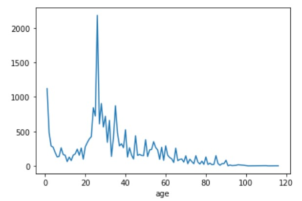

# Predict-age-gender-and-ethnicity-from-image-using-Deep-Learning
The purpose of this model is to predict a person's age, gender, and ethnicity once provided with a grayscale image of that person.

### Dataset
Dataset that has grayscale images of 48x48 dimensions representing individuals from five ethnic groups. The individuals were also categorized according to gender and annotated with age. The graph mentioned below demonstrates the age distribution within the dataset.
                            

The dataset contains 23479 images divided into train, validation and test folders. The validation and test sets contain 20% of the total dataset. In addition to the grayscale images, are provided with the “age_gender.csv”, which contains the following fields:

Age: age of the individual  
Gender: gender of the individual  
Ethnicity: ethnicity of the individual   
Img_name: name of the image to be linked with the image in either train, val or test folders  

You can download the materials,
containing the following files and folder. The purpose of each file and folder is
mentioned below:
* data/images/train: Contains the images to be used when training the model  
* data/images/val: Contains the images to be used for validating the model  
* data/images/test: Contains the images to be used as the test data to identify how well your model has generalized  
* code.ipynb: This is the code file  
* model: The folder contain model weights  
* logs: The folder contain tensorboard logs  
